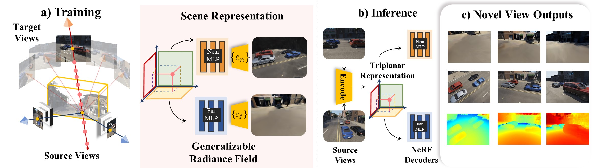
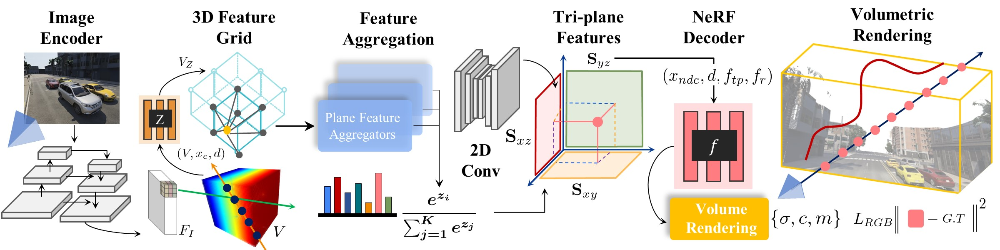
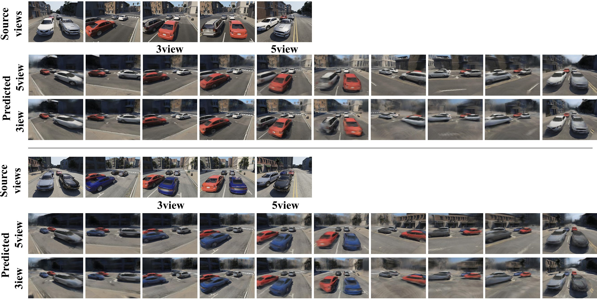
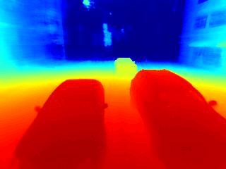

# NEO 360: Neural Fields for Sparse View Synthesis of Outdoor Scenes

This repository is the pytorch implementation of our **ICCV2023** paper.

<a href="https://www.tri.global/" target="_blank">
 
</a>

### [Project Page](https://zubair-irshad.github.io/projects/neo360.html) | [arXiv](https://arxiv.org/abs/2308.12967) | [PDF](https://arxiv.org/pdf/2308.12967.pdf) | [Video](https://youtu.be/avmylyL_V8c?si=eeTPhl0xJxM3fSF7)

<a href="https://www.tri.global/" target="_blank">
 
</a>

**NEO 360: Neural Fields for Sparse View Synthesis <br> of Outdoor Scenes**<br>

<a href="https://zubairirshad.com"><strong>Muhammad Zubair Irshad</strong></a>
·
<a href="https://zakharos.github.io/"><strong>Sergey Zakharov</strong></a>
·
<a href="https://www.thekatherineliu.com/"><strong>Katherine Liu</strong></a>
·
<a href="https://www.linkedin.com/in/vitorguizilini"><strong>Vitor Guizilini</strong></a>
·
<a href="http://www.tkollar.com/site/"><strong>Thomas Kollar</strong></a>
·
<a href="https://faculty.cc.gatech.edu/~zk15/"><strong>Zsolt Kira</strong></a>
·
<a href="https://www.tri.global/about-us/dr-rares-ambrus"><strong>Rares Ambrus</strong></a>
<br>
International Conference on Computer Vision (ICCV), 2023<br>

<!-- [__***Muhammad Zubair Irshad***__](https://zubairirshad.com), [Sergey Zakharov](https://zakharos.github.io/), [Katherine Liu](https://www.thekatherineliu.com/), [Vitor Guizilini](https://www.linkedin.com/in/vitorguizilini), [Thomas Kollar](http://www.tkollar.com/site/), [Adrien Gaidon](https://adriengaidon.com/), [Zsolt Kira](https://faculty.cc.gatech.edu/~zk15/), [Rares Ambrus](https://www.tri.global/about-us/dr-rares-ambrus) <br>
International Conference on Computer Vision (ICCV), 2023<br> -->

<b>Georgia Institute of Technology &nbsp; | &nbsp;  Toyota Research Institute </b>

<p align="center">

</p>

<p align="center">

</p>

## Citation

If you find this repository or our NERDS 360 dataset useful, please consider citing:

```
@inproceedings{irshad2023neo360,
  title={NeO 360: Neural Fields for Sparse View Synthesis of Outdoor Scenes},
  author={Muhammad Zubair Irshad and Sergey Zakharov and Katherine Liu and Vitor Guizilini and Thomas Kollar and Adrien Gaidon and Zsolt Kira and Rares Ambrus},
  journal={Interntaional Conference on Computer Vision (ICCV)},
  year={2023},
  url={https://arxiv.org/abs/2308.12967},
}
```

### Contents
 - [🌇  Environment](#-environment)
 - [⛳ **Dataset (Updated with colmap poses)**](#-dataset)
 - [🔖 Dataloaders](#-dataloaders)
 - [💫 Inference](#-inference)
 - [📉 Generalizable Training](#-generalizable-training)
 - [📊 Overfitting Training Runs](#-overfitting-training-runs)
 - [📌 FAQ](#-faq)

## 🌇  Environment

Create a python 3.7 virtual environment and install requirements:

```bash
cd $NeO-360 repo
conda create -n neo360 python=3.7
conda activate neo 360
pip install --upgrade pip
pip install -r requirements.txt
pip install torch==1.11.0+cu113 torchvision==0.12.0+cu113 -f https://download.pytorch.org/whl/torch_stable.html
export neo360_rootdir=$PWD
```
The code was built and tested on **cuda 11.3**

## ⛳ Dataset

### NERDS 360 Multi-View dataset for Outdoor Scenes

NeRDS 360: "NeRF for Reconstruction, Decomposition and Scene Synthesis of 360° outdoor scenes” dataset comprising 75 unbounded scenes with full multi-view annotations and diverse scenes for generalizable NeRF training and evaluation.

<p align="center">

</p>

#### Download the dataset:
* [NERDS360 Training Set](https://tri-ml-public.s3.amazonaws.com/github/neo360/datasets/PDMultiObjv6.tar.gz) - 75 Scenes (19.5 GB)
* [NERDS360 Test Set](https://tri-ml-public.s3.amazonaws.com/github/neo360/datasets/PD_v6_test.tar.gz) - 5 Scenes (2.1 GB)

* [NERDS360 Colmap](https://drive.google.com/file/d/13jcD0_ad0vP9H6AGFfhj2ZHb1UWkW_zt/view?usp=sharing) - 10 Scenes (2.1 GB)

Extract the data under ```data``` directory or provide a symlink under project ```data``` directory. The directory structure should look like this ```$neo360_rootdir/data/PDMuliObjv6```

Colamp poses can be used for techniques such as [3D Gaussian Splatting](https://repo-sam.inria.fr/fungraph/3d-gaussian-splatting/). Please see our [overfitting experiments](https://github.com/zubair-irshad/NeO-360?tab=readme-ov-file#overfitting-gaussiansplatting) for more details.

#### Visualizing the dataset:
To plot accumulated pointclouds, multi-view camera annotations and bounding boxes annotations as shown in the visualization below, run the following commands. This visualization script is adapted from [NeRF++](https://github.com/Kai-46/nerfplusplus). 

Zoom-in the visualization to see the objects. Red cameras are source-view cameras and all green cameras denote evaluation-view cameras.

```python
python visualize/visualize_nerds360.py --base_dir PDMultiObjv6/train/SF_GrantAndCalifornia10
```

### Semantic Labels

Semantic labels for our dataset are included in ```utils/semantic_labels.py```. For instance the car corresponds to id 5, Road is id 24 and so on.

<p align="center">

</p>


You could also run the following to just visualize the poses in a unit sphere after normalization:

```python
python visualize/visualize_poses.py --base_dir PDMultiObjv6/train/SF_GrantAndCalifornia10
```

## 🔖 Dataloaders

We provide two conveneint dataloaders written in **pytorch** for a. single-scene overfitting i.e. settings like testing [MipNeRF-360](https://jonbarron.info/mipnerf360/) and b. generalizable evaluation i.e. few-shot setting introduced in our paper. There is a convenient ```read_poses``` function in each of the dataloaders. Use this function to see how we load poses with the corresponding images to use our **NERDS360** dataset with any NeRF implementation.

a. Our dataloader for single scene overfitting is provided in ```datasets/nerds360.py```. This dataloader directly outputs RGB, poses pairs in the same format as [NeRF](https://github.com/bmild/nerf)/[MipNeRF-360](https://jonbarron.info/mipnerf360/) and could be used with any of the NeRF implementation i.e. nerf-studio, nerf-factory or nerf-pl.

b. Our dataloader for generalizable training is provided in ```datasets/nerds360_ae.py```. ```ae``` denotes auto-encoder style of training. This datalaoder is used for the few-shot setting proposed in our NeO360 paper. During eery training iteration, we randomly select 3 source views and 1 target view and sample 1000 rays from target view for decoding the radiance field. This is the same dataloader you'll see gets utilized next during training below.

**Note**: Our NeRDS360 dataset also provides **depth map, NOCS maps, instance segmentation, semantic segmentation and 3D bounding box annotations** (all of these annotations are not used either during training or during inference and we only use RGB images). Although these annotations can be used for other computer vision tasks to push the SOTA for unbounded outdoor tasks like instance segmentation. All the other annotations are easy to load and provided as ```.png``` files

Additionally, to output a convenient ```transforms.json``` file for a scene in the original [NeRF's blender format data](https://github.com/bmild/nerf), run the following:

```python
python convert_to_nerf_blender --base_dir PDMultiObjv6/train/SF_GrantAndCalifornia10
```

Note that creating a trasnforms.json file is not required for running our codebase and is merely a convenient script to work with other NeRF architectures.

## ✨ Inference

Download the validation split from [here](https://drive.google.com/file/d/1eju8k54NvkKXAWqlpB8sXN_A7G4F4C5o/view?usp=sharing). These are scenes never seen during training and are used for visualization from a pretrained model.


Download the pretrained checkpoint from [here](https://drive.google.com/file/d/1-ZHbAsvG6Z3DIz3foez0zYJ2txVxIr-C/view?usp=sharing)

Extract them under the project folder with directory structure ```data``` and ```ckpts```.


Run the following script to run visualization i.e. 360&deg; rendering from just 3 or 5 source views given as input:

```python
python run.py --dataset_name nerds360_ae --exp_type triplanar_nocs_fusion_conv_scene --exp_name multi_map_tp_CONV_scene --encoder_type resnet --batch_size 1 --img_wh 320 240 --eval_mode vis_only --render_name 5viewtest_novelobj30_SF0_360_LPIPS --ckpt_path finetune_lpips_epoch=30.ckpt --root_dir $neo360_rootdir/data/neo360_valsplit/test_novelobj
```

You would see images which would produce renderings like the last column as shown below. 10 of the 100 rendered views randomly sampled are shown in the second diagram below:

<p align="center">

</p>


<p align="center">

</p>


For evaluation i.e. logging psnr, lpips and ssim metrics as reported in the paper, run the following script:

```python
python run.py --dataset_name nerds360_ae --exp_type triplanar_nocs_fusion_conv_scene --exp_name multi_map_tp_CONV_scene --encoder_type resnet --batch_size 1 --img_wh 320 240 --eval_mode full_eval --render_name 5viewtest_novelobj30_SF0_360_LPIPS --ckpt_path finetune_lpips_epoch=30.ckpt --root_dir $neo360_rootdir/data/neo360_valsplit/test_novelobj
```

The current script evaluates the scenes one by one. Note that 3 or 5 source views are not part of any of the rendered 100 360&deg; views and are chosen randomly from the upper hemisphere (currently hardcoded random views) 

If your checkpoint was finetuned with additional LPIPS loss then the render name must have LPIPS in order to load the LPIPS weights during rendering. See our model and code for further clarification.


## 📉 Generalizable Training

We train on the full NERDS 360 Dataset in 2 stages. First we train using a mix of photometric loss (i.e. MSE loss) + a distortion auxillary loss for 30-50 epochs. We then finetune with an addition of LPIPS loss for a few epochs to imporve the visual fidelity of results. 

All our experiments were performed on 8 Nvidia A100 GPUs. Please refer to our paper for more details.

Stage 1 training, please run:

```python
python run.py --dataset_name nerds360_ae --root_dir $neo360_rootdir/data/PDMultiObjv6/train/ --exp_type triplanar_nocs_fusion_conv_scene --exp_name multi_map_tp_CONV_scene --encoder_type resnet --batch_size 1 --img_wh 320 240 --num_gpus 8
```

Stage 2 finetuning with an additional LPIPS loss, please specificy the checkpoint from which to finetune and add finetune_lpips flag to run the command below:

```python
python run.py --dataset_name nerds360_ae --root_dir $neo360_rootdir/data/PDMultiObjv6/train --exp_type triplanar_nocs_fusion_conv_scene --exp_name multi_map_tp_CONV_scene --encoder_type resnet --batch_size 1 --img_wh 320 240 --num_gpus 8 --ckpt_path epoch=29.ckpt --finetune_lpips
```

At the end of training run, you will see checkpoints stored under ```ckpts/$exp_name``` directory with stage 1 training run checkpoints labelled as ```epoch=aa.ckpt``` and finetune checkpoints labelled as ```finetune_lpips_epoch=aa.ckpt```

We also provide an ```is_optimize``` flag to finetune on the few-shot source images of a new domain as well. Please refer to our paper for more details on what this flag refers and if this is useful for your case. 

We also provide a home-grown implementation of [PixelNeRF](https://github.com/sxyu/pixel-nerf) which is built on top of NeRF-Factory and Pytorch Lightning. If you are a user of both of these, you might find it helpful. Just use exp_type ```pixelnerf``` and our generalizable dataset ```nerds360_ae``` to run pixelnerf training and evaluation with the scripts mentioned above :) 

## 📊 Overfitting Training Runs


### Overfitting [NeRFs](https://github.com/bmild/nerf)

While over proposed technique is a generalizable method which works in a few-shot setting, for the ease of reproducibility and to push the state-of-the-art on single scene novel-view-synthesis of unbounded scenes, we provide scripts to overfit to single scenes given many images. We provide [NeRF](https://github.com/bmild/nerf) and [MipNeRF-360](https://jonbarron.info/mipnerf360/) baselines from [NeRF-Factory](https://github.com/kakaobrain/nerf-factory) with our newly proposed NeRDS360 dataset. 

To overfit to a single scene using vanilla NeRF on NERDS360 Dataset, simply run:

```python
python run.py --dataset_name nerds360 --root_dir $neo360_rootdir/data/PD_v6_test/test_novel_objs/SF_GrantAndCalifornia6 --exp_type vanilla --exp_name overfitting_test_vanilla_2 --img_wh 320 240 --num_gpus 7
```

For evaluation, run:

```python
python run.py --dataset_name nerds360 --root_dir $neo360_rootdir/data/PD_v6_test/test_novel_objs/SF_GrantAndCalifornia6 --exp_type vanilla --exp_name overfitting_test_vanilla_2 --img_wh 320 240 --num_gpus 1 --eval_mode vis_only --render_name vanilla_eval
```

You'll see results as below. We achive a test-set PSNR of 24.75 and SSIM of 0.78 for this scene.

<div align="center">
  
  
</div>

To overfit to a single scene using MipNeRF360 on NERDS360 Dataset, simply run:

```python
python run.py --dataset_name nerds360 --root_dir $neo360_rootdir/data/PD_v6_test/test_novel_objs/SF_GrantAndCalifornia6 --exp_type mipnerf360 --exp_name overfitting_test_mipnerf360_2 --img_wh 320 240 --num_gpus 7
```

### Overfitting [GaussianSplatting](https://repo-sam.inria.fr/fungraph/3d-gaussian-splatting/)

You can use ```convert_to_nerf_blender.py``` script as shown above to create a ```transforms.json``` file in NeRF's blender format to train a Gaussian Splatting. One could also run colmap on our provided images and then train gaussian splatting using [nerfstudio](https://docs.nerf.studio/). We benchmarked overfitting Gaussian Splatting on NERDS360 dataset and achieved a PSNR of around 31 by just training for a few minutes on a single GPU to get the following output.

<p align="center">

</p>

## 📌 FAQ

1. The compute requirements are very high. How do I run NeO-360 on low-memory GPUs:

Please see [this](https://github.com/zubair-irshad/NeO-360/issues/10#issuecomment-1868560843) thread on things to try to reduce compute load. 

2. Can I use NERDS360 dataset with my own NeRF implementation or other architectures?

Absolutely, you can use NERDS360 with [Gaussian Splatting](https://repo-sam.inria.fr/fungraph/3d-gaussian-splatting/) or any other NeRF implementation in both overfitting (i.e. many views scenario) or few-shot (i.e. few-views scenario). Please see [Dataloaders](https://github.com/zubair-irshad/NeO-360?tab=readme-ov-file#-dataloaders) and use any of our pre-released dataloaders with your implementation. Please note that a wrapper might have to be written on top of our dataloader to try Gaussian Splatting with our dataset with requires full-images and not just rays.


## Acknowledgments
This code is built upon the implementation from [nerf-factory](https://github.com/kakaobrain/nerf-factory), [NeRF++](https://github.com/Kai-46/nerfplusplus) and [PixelNeRF](https://github.com/sxyu/pixel-nerf) with distortion loss and unbounded scene contraction used from [MipNeRF360](https://github.com/google-research/multinerf). Kudos to all the authors for great works and releasing their code. Thanks to the original [NeRF](https://github.com/bmild/nerf) implementation and the pytorch implementation [nerf_pl](https://github.com/kwea123/nerf_pl) for additional inspirations during this project. 

## Licenses
This repository and the NERDS360 dataset is released under the [CC BY-NC 4.0](https://github.com/zubair-irshad/NeO-360/blob/master/LICENSE.md) license.

